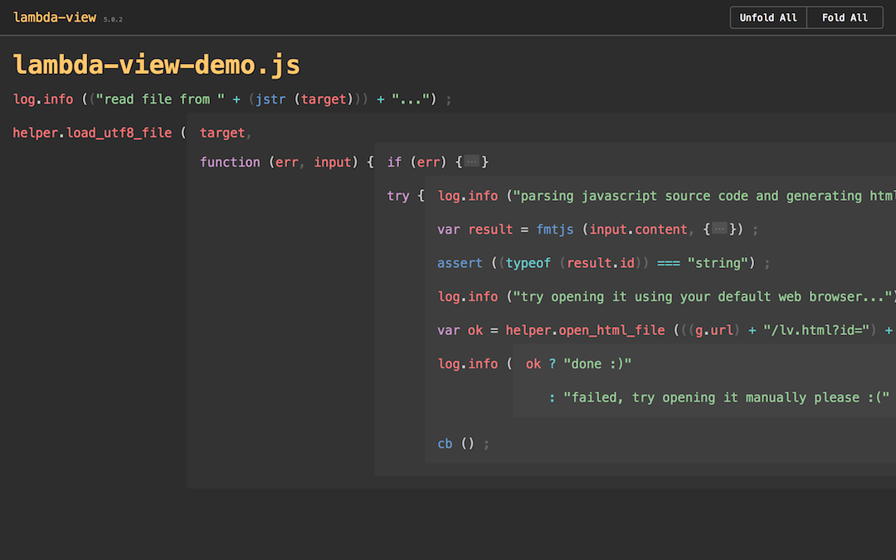

# lambda-view: A New Tool for Reading JavaScript Code in 2017

lambda-view provides you a better way to READ JavaScript source code. 

# Screenshots & Demos



You can try read express.js framework source code here: [http://demo.lambda-view.com/lv.html?package=express](http://demo.lambda-view.com/lv.html?package=express)

Or some Node.js modules source code here:

(public modules)

* [assert](http://demo.lambda-view.com/lv.html?package=assert)
* [domain](http://demo.lambda-view.com/lv.html?package=domain)
* [path](http://demo.lambda-view.com/lv.html?package=path)
* [timers](http://demo.lambda-view.com/lv.html?package=timers)
* [buffer](http://demo.lambda-view.com/lv.html?package=buffer)
* [events](http://demo.lambda-view.com/lv.html?package=events)
* [process](http://demo.lambda-view.com/lv.html?package=process)
* [tls](http://demo.lambda-view.com/lv.html?package=tls)
* [child_process](http://demo.lambda-view.com/lv.html?package=child_process)
* [fs](http://demo.lambda-view.com/lv.html?package=fs)
* [punycode](http://demo.lambda-view.com/lv.html?package=punycode)
* [tty](http://demo.lambda-view.com/lv.html?package=tty)
* [cluster](http://demo.lambda-view.com/lv.html?package=cluster)
* [http](http://demo.lambda-view.com/lv.html?package=http)
* [querystring](http://demo.lambda-view.com/lv.html?package=querystring)
* [url](http://demo.lambda-view.com/lv.html?package=url)
* [console](http://demo.lambda-view.com/lv.html?package=console)
* [https](http://demo.lambda-view.com/lv.html?package=https)
* [readline](http://demo.lambda-view.com/lv.html?package=readline)
* [util](http://demo.lambda-view.com/lv.html?package=util)
* [constants](http://demo.lambda-view.com/lv.html?package=constants)
* [repl](http://demo.lambda-view.com/lv.html?package=repl)
* [v8](http://demo.lambda-view.com/lv.html?package=v8)
* [crypto](http://demo.lambda-view.com/lv.html?package=crypto)
* [module](http://demo.lambda-view.com/lv.html?package=module)
* [stream](http://demo.lambda-view.com/lv.html?package=stream)
* [vm](http://demo.lambda-view.com/lv.html?package=vm)
* [dgram](http://demo.lambda-view.com/lv.html?package=dgram)
* [net](http://demo.lambda-view.com/lv.html?package=net)
* [string_decoder](http://demo.lambda-view.com/lv.html?package=string_decoder)
* [zlib](http://demo.lambda-view.com/lv.html?package=zlib)
* [dns](http://demo.lambda-view.com/lv.html?package=dns)
* [os](http://demo.lambda-view.com/lv.html?package=os)
* [sys](http://demo.lambda-view.com/lv.html?package=sys)

(internal modules)

* [_debug_agent](http://demo.lambda-view.com/lv.html?package=_debug_agent)
* [_stream_duplex](http://demo.lambda-view.com/lv.html?package=_stream_duplex)
* [_debugger](http://demo.lambda-view.com/lv.html?package=_debugger)
* [_stream_passthrough](http://demo.lambda-view.com/lv.html?package=_stream_passthrough)
* [_http_agent](http://demo.lambda-view.com/lv.html?package=_http_agent)
* [_stream_readable](http://demo.lambda-view.com/lv.html?package=_stream_readable)
* [_http_client](http://demo.lambda-view.com/lv.html?package=_http_client)
* [_stream_transform](http://demo.lambda-view.com/lv.html?package=_stream_transform)
* [_http_common](http://demo.lambda-view.com/lv.html?package=_http_common)
* [_stream_wrap](http://demo.lambda-view.com/lv.html?package=_stream_wrap)
* [_http_incoming](http://demo.lambda-view.com/lv.html?package=_http_incoming)
* [_stream_writable](http://demo.lambda-view.com/lv.html?package=_stream_writable)
* [_http_outgoing](http://demo.lambda-view.com/lv.html?package=_http_outgoing)
* [_tls_common](http://demo.lambda-view.com/lv.html?package=_tls_common)
* [_http_server](http://demo.lambda-view.com/lv.html?package=_http_server)
* [_tls_legacy](http://demo.lambda-view.com/lv.html?package=_tls_legacy)
* [_linklist](http://demo.lambda-view.com/lv.html?package=_linklist)
* [_tls_wrap](http://demo.lambda-view.com/lv.html?package=_tls_wrap)
* [internal/freelist](http://demo.lambda-view.com/lv.html?package=internal/freelist)
* [internal/net](http://demo.lambda-view.com/lv.html?package=internal/net)
* [internal/readline](http://demo.lambda-view.com/lv.html?package=internal/readline)
* [internal/socket_list](http://demo.lambda-view.com/lv.html?package=internal/socket_list)
* [internal/v8_prof_polyfill](http://demo.lambda-view.com/lv.html?package=internal/v8_prof_polyfill)
* [internal/child_process](http://demo.lambda-view.com/lv.html?package=internal/child_process)
* [internal/linkedlist](http://demo.lambda-view.com/lv.html?package=internal/linkedlist)
* [internal/v8_prof_processor](http://demo.lambda-view.com/lv.html?package=internal/v8_prof_processor)
* [internal/cluster](http://demo.lambda-view.com/lv.html?package=internal/cluster)
* [internal/module](http://demo.lambda-view.com/lv.html?package=internal/module)
* [internal/process](http://demo.lambda-view.com/lv.html?package=internal/process)
* [internal/repl](http://demo.lambda-view.com/lv.html?package=internal/repl)
* [internal/util](http://demo.lambda-view.com/lv.html?package=internal/util)
* [internal/process/next_tick](http://demo.lambda-view.com/lv.html?package=internal/process/next_tick)
* [internal/process/promises](http://demo.lambda-view.com/lv.html?package=internal/process/promises)
* [internal/process/stdio](http://demo.lambda-view.com/lv.html?package=internal/process/stdio)
* [internal/process/warning](http://demo.lambda-view.com/lv.html?package=internal/process/warning)
* [internal/streams/BufferList](http://demo.lambda-view.com/lv.html?package=internal/streams/BufferList)
* [internal/streams/lazy_transform](http://demo.lambda-view.com/lv.html?package=internal/streams/lazy_transform)

# You can read any other JavaScript project

You are not limited to the demos! Just install lambda-view then read any JavaScript file you'd like to!

# Get started in 2 steps

STEP-1 install it via npm (sudo required maybe):

```
npm install -g lambda-view
```

STEP-2 use lv command to open any JavaScript file:

```
lv target.js
```

Then (if everything is ok), your web browser will be opened automatically and shows you the result. Pretty easy, right? 

# Talk to me

I created a gitter chat room here: 

[](https://gitter.im/Jianru-Lin/lambda-view?utm_source=badge&utm_medium=badge&utm_campaign=pr-badge)

# Helpful tips

### Can I open remote file by URL?

Yes, lv command accepts URL:

```
lv https://code.jquery.com/jquery-3.1.1.js
```

### Can I open multiple files in one command?

Yes, you can provide multiple filenames to lv command:

```
lv file1.js file2.js file3.js
```

Further more, you can use the wildcard (For Linux/Mac only, Not Windows):

```
lv *.js
```

### Can I use lambda-view on my iphone/ipad?

Yes. 

This is an experimental feature. 

lambda-view embeded a small web server which accepts local access only by default. However you can reconfigure it to accept public access. This makes your computer become a web server that can be accessed by your iphone/ipad. 

You can achieve it in 3 steps.

STEP-1 stop current lambda-view web server:

```
lv-svr stop
```

STEP-2 start lambda-view web server with public mode:

```
lv-svr start --public --background
```

STEP-3 open any JavaScript file you want to read on your iphone/ipad:

```
lv some-file.js
```

Now, the web browser will be opened, and you can copy it's URL to your iphone/ipad's safari. Then you can read it. (Your iphone/ipad )

Please make sure:

* Your computer and your iphone/ipad must connected to the same LAN
* If there is any firewall enabled on your computer, please configure it to allow public access on TCP port 23400

# Future plans

This is just a begining. I'll add more features soon. 
